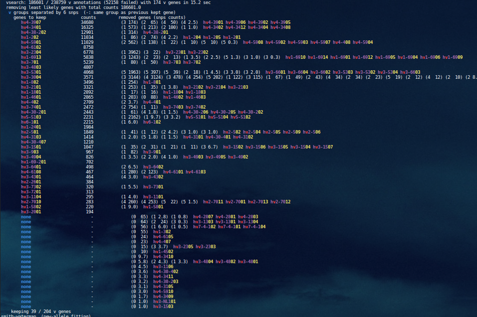
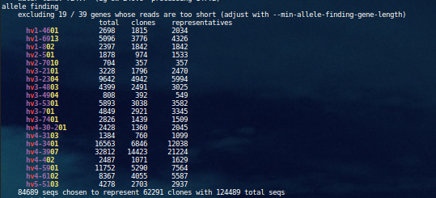
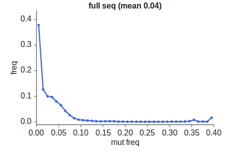
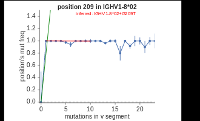
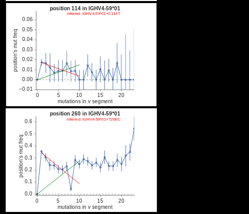

#### Evaluating confidence in germline inference

We unfortunately do not yet have a way to report simple confidence estimates for each gene in the inferred germline set.
There is, however, a wealth of information that can be used to get a good sense of this confidence, and here we describe how to interpret it.
The following probably will not make much sense without some familiarity with the corresponding paper:

  * [Germline inference](https://arxiv.org/abs/1711.05843) Ralph, DK, & Matsen IV, FA (in review at PLOS Computational Biology) _Per-sample immunoglobulin germline inference \[...\]_ 

First off, you should run with a few extra arguments that tell partis to output more information than by default.
Set `--plotdir <dir>` to write the mutation accumulation fit plots to disk, as well as `--debug-allele-finding` to print extra info to std out.
It's probably worth piping the resulting std out to a log file, e.g. with `<cmd> >log.txt`, and viewing afterward with `less -RS` (typically looks nicer with a dark background terminal).
The example log file that we'll describe in detail below can be found [here](images/example-log.txt).

The first step in germline inference is allele removal, where we group all V genes with matches into subgroups such that genes within a group are separated by a handful of point mutations (i.e. confusable by SHM), but genes in different groups are not.
This process is illustrated in the first block of output printed by `--debug-allele-finding`, a screenshot of which is included here:

Each entry in the lefthand "genes to keep" column is a kept gene, i.e. the most common gene from that group, with the corresponding counts in the next column.
The alleles within that group that were removed are detailed in the last column.
This last column consists of two lists: a list of parenthesis-inclosed numbers for each removed gene (number of SNPs to the kept gene, and the counts), and the corresponding list of removed gene names.

After reducing the germline set to a minimal list of genes about whose presence we can be quite confident, partis then runs smith-waterman alignment on these genes, and performs new-allele inference.
This will re-infer any genes that were removed in the first step for which there is substantial evidence, along with any novel alleles (alleles not in the original germline set).

Because the mutation accumulation plots require independent mutation events, it then collapses clonal families into a small number of representatives.
The results are summarized in the debug output, an example of which is shown here:

Where the first line, for instance, tells us that 2698 total sequences aligned most closely to IGHV1-46*01, that these corresponded to 1815 clonal families, and that 2034 sequences were chosen to represent these clonal families in germline inference.

Next we print a summary of the number of mutations observed in the sequences assigned to each gene in which the top line is the number of mutations:

So, for instance, the top line tells us that we found 772 unmutated sequences assigned to IGHV1-46*01, 184 with one mutation, etc.

The next section documents the results of the method of excluding sequences that are missing too many bases one the 5' or 3' ends.
Details of this procedure can be found in the paper, and for most purposes this summary is probably not super interesting.

Next, it performs the actual germline inference fits for each gene.
Skipping a few sections to the one corresponding to IGHV1-69*13:

Within this block, there's a subsection for each candidate allele (number-of-SNPs) that was deemed interesting.
The first one (3 snps) has a row for each of the corresponding three positions (169, 219, 162; note: as everywhere, these are zero-indexed positions).
The primary measure of confidence in the inference is the ratio of the goodness of fit for the one piece vs two piece fits, which is the next column.
The first position (169) has a ratio of 26, which means the one piece fit was vastly worse than the two piece fit.
This is broken down in the next column (459. / 18.), which tells us that the one piece fit had a chi-square/dof of 459, while the two piece had 18.
Generally speaking, 18 is of course still a pretty dismal goodness of fit, even if it's vastly better than 459, so this is a good time to look at the corresponding plots.
The html summary for example is [here](http://psathyrella.github.io/partis/example-plots/germline-inference/try-0.html); each row corresponds to an inferred allele, and you can click on each plot to get the underlying svg.
Here's a screenshot of the row corresponding to the IGHV1-69*13 inference:

These are the same three positions as in the previous paragraph, and each bin in these plots corresponds to a column in the table.
For instance, the fourth column in the table for position 169 says that of the 1892 unmutated sequences, zero were mutated at position 169.
Somewhat less tautologically, the next column says that of the 1269 sequences with one V mutation, two had that mutatio nat position 169.
These are exactly the numbers that go into the bins in the fit plots.

The fit plots show the one-piece (null hypothesis) in green, and the two-piece (new allele hypothesis) in red.
And here we see that, indeed, the red fits much better than the green, but is still a pretty crappy fit.
In this case, the poor fit of the two-piece fit is actually expected: this sample happens to have a very low SHM rate, with a big spike near zero.
The SHM distributions are written under your plotdir at `<plotdir>/sw/mute-freqs/overall.html`, and are screenshot here:

This spike in overall SHM rate creates a spike in the 3-bin in these fits, and is the reason that we use the ratio of goodness of fit values.
The're many more details in the paper, but in short everything is working as it should.

Taking it all together, this is a very strong inference.
The ratio of goodness of fit values for one piece/two piece is very large, and while it's not shown in the paper, this is distributed as essentially a normal distribution.
This means that it corresponds roughly to p-values, i.e. a value between two and three corresponds to between roughly .1 and 1 percent, hence why the thresholds for calling new genes are around that range (see paper).

Continuing down, the next block in the IGHV1-69\*13 table above is for a 7-SNP candidate that is not significant.
Then, it says that the minimum ratio among positions for the 3-SNP candidate was 20, which is big, so it infers the allele.
It then checks through known genes, and discovers that this is a known gene (that, indeed, was removed in the first step): IGHV1-69\*10.

The rest of the log file has similar information for the rest of the inferences, and summary information at the end.
But for our purposes, it's quicker to glance through the rest of the plots in the html file linked above.
The second row shows a slam-dunk inference of an allele with prevalence of 1 (i.e. the "template" gene isn't actually present):

Scrolling down further, the two inferences from a template of IGHV4-59*01 are interesting:

They're both pretty solid fits in that the two-piece red fit describes the data well, but they're quite difference in prevalence.
The bottom one (position 260) has much higher prevalence (30-40%), and thus enough observations for very confident inference (cross-referencing to the log file, it has a one-piece/two-piece ratio of 10
The top one, though (position 114), has a prevalence of only 1-2%, and as seen by the uncertainties in the fit plot, it is far less certain.
Looking at the log file, this has a high ratio of 18, but this is entirely due to a very low goodness of fit of 0.15, which indicates an unrealistically good fit, which is essentially always due to chance.
In the plot, you can see this -- the points are scattered much less than you'd expect based on the uncertainties.
More importantly, the green null hypothesis doesn't actually fit that badly (goodness of fit of 2.72), indicating decent, but not overwhelming, confidence.

Finally, the prevalence frequencies for each gene in the final germline set are also worth looking at.
These are in the `--plotdir`, under `<plotdir>/sw/overall/{v,d,j}_gene.{csv,svg}`, with the svg version screenshotted here:

but the csv version probably generally more useful.
These are also written after the hmm step (in `<plotdir>/hmm/overall/{v,d,j}_gene.{csv,svg}`), and those will generally be very similar, except that a more stringent minimum prevalence threshold is applied, so any genes with a very small number of counts will be absent.
This is probably more accurate, hence why it's done that way, but is far from assured that they're not actually present at a low level.
Note that this prevalence info is also written to the `--parameter-dir`, so is available even if `--plotdir` isn't set.
